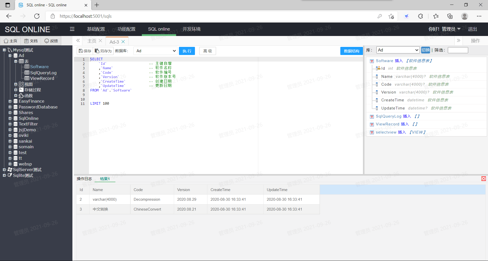
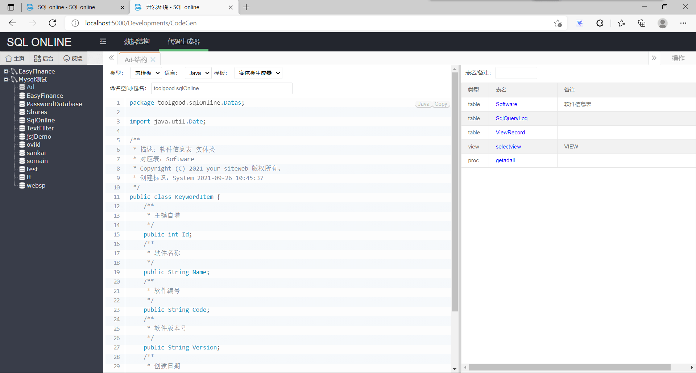
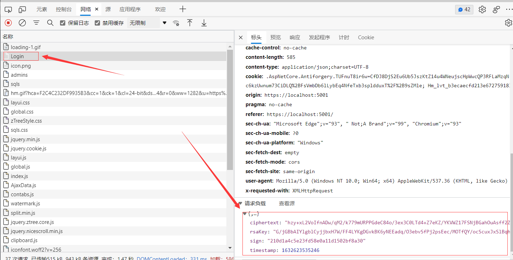
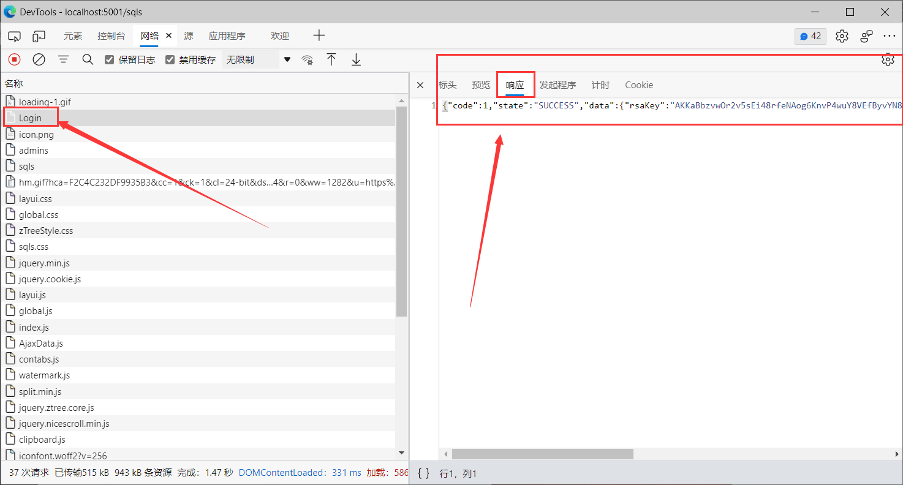

# SQL online

《SQL online》是一款免费的SQL在线编辑器，主打数据安全，跨平台支持windows、Linux。

官网：https://www.sqlonline.net

交流群：950217920，验证码：sqlonline

## SQL online 编译后程序下载

下载地址：https://pan.baidu.com/s/1sTFu_eGQxtHyEEZYBaRdJg 提取码：5bkj 

账号：admin 密码：a123456 管理密码：a123456789

## 核心功能
    1、SQL执行权限细分：(1)Select；(2)Insert/Update；(3)Delete；(4)Admin。

    2、按扭分为【执行】与【高级】两个按钮，区分执行Select语句和其他语句。

    3、Select语句设有上限，防数据泄漏。

    4、执行Insert/Update/Delete/Admin权限的语句需要管理密码。

    5、系统自动记录执行SQL语句，当语句为Update、Delete时，保存操作前的数据。

    6、Update、Delete语句拒绝执行不带where的语句。

    7、Update、Delete语句设有修改行数上限，防止粗心造成大范围误操作。

    8、执行Insert/Update/Delete/Admin权限的语句，开启事务，一句出错，全部回滚。

    9、SQL执行时可暂停。

## 安全策略
    1、账号密码分为登录密码、管理密码。

    2、登录界面防止浏览器自动记录账号密码。

    3、登录账号密码使用RSA加密，与https配合更安全。

    4、登录可绑定机器码，必须使用专用浏览器。

    5、登录次数根据ip限制。

    6、每次登录都有登录日志。

    7、同一账号只允许一个人登录。
    
    8、内设IP黑名单、IP白名单系统。

    9、数据传输（POST）全程加密，可自定义RSA私钥。

    10、数据传输（POST）有时间截验证。

    11、每个修改页面都有AntiForgeryToken，防跨域攻击。

    11、界面可设水印，防员工私下载屏泄露机密。

    12、界面左上角可设标识，防止员工在正式环境误操作。

## 其他功能：
    1、数据结构快速查询、可只显示标记的表信息。

    2、SQL语句高亮、结合数据结构快速插入表名、列名。

    3、SQL文档库、SQL文档分享库。

    4、编辑SQL语句时，每5秒保存一次。

    5、支持开发环境：（默认关闭）

        （1）数据结构查询

        （2）代码生成器

    目前支持MySql、SqlServer、Sqlite三种数据库语言。

## 页面展示
SQL编辑页面：

代码生成：

POST加密：

## 调试说明
先执行ToolGood.DataCreate，生成数据文件。

## 开发计划：
    1、SQL自动提示

    2、报表功能

    3、报表定时发邮件

    4、SQL相关搜索

    5、支持MongoDB

    6、支持PostgreSQL

    7、支持Oracle

    8、表对比工具

    9、多语言支持

    10、Select语句支持下载 

## LICENSE
    您可以在GPLv3许可证下使用它。请参阅LICENSE。