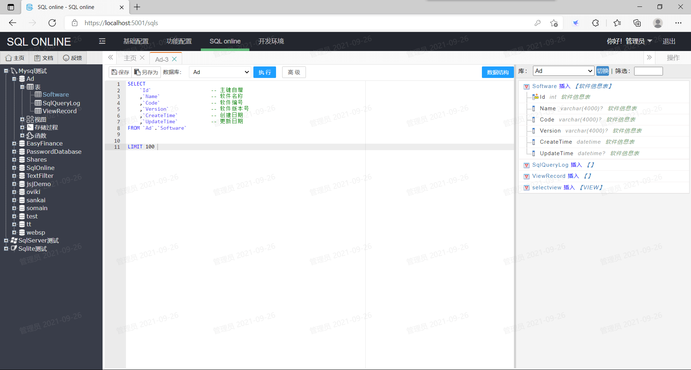

# SQL online

《SQL online》是一款免费的SQL在线编辑器，主打数据安全，跨平台支持windows、Linux。

下载地址：https://pan.baidu.com/s/1sTFu_eGQxtHyEEZYBaRdJg 提取码：5bkj 

账号：admin 密码：a123456 管理密码：a123456789

## 主要功能：
    1、登录界面防止浏览器自动记录账号密码。

    2、登录账号密码使用RSA加密，与https配合更安全。

    3、登录可绑定机器码，使用专用浏览器。

    4、内设IP黑名单、IP白名单系统。

    5、登录次数根据ip限制。

    6、每次登录都有登录日志。

    7、同一账号只允许一个人登录。

    8、账号分登录密码、管理密码，较高权限的页面使用管理密码。

    9、数据传输（POST）全程加密，可自定义RSA私钥。

    10、数据传输（POST）有时间截验证。

    11、每个修改页面都有AntiForgeryToken，防跨域攻击。

    11、界面可设水印，防员工私下载屏泄露机密。

    12、界面左上角可设标识，防止员工在正式环境误操作。

    13、数据库可设多个，并且可设置访问角色。

    14、数据库执行权限细分：Select、Insert/Update、Delete、所有权限。

    15、SQL查询有记录、可设置记录的数据库（MySql/SqlServer/Sqlite）

    16、Insert/Update/Delete、所有权限操作需要使用管理密码。

    17、Insert/Update/Delete操作时，记录操作前数据样本。

    18、数据结构快速查询、可只显示标记的表信息。

    19、SQL语句高亮、结合数据结构快速插入表名、列名。

    20、可停止正在执行的SQL查询。

    21、编辑SQL语句时，每5秒保存一次。

    22、SQL文档库、SQL文档分享库。

    23、目前支持MySql、SqlServer、Sqlite三种数据库语言。

 
## 其他功能：
    开发环境：（默认关闭）

        1、数据结构查询

        2、代码生成器
## 页面展示
SQL编辑页面：

代码生成：

POST加密：

## 开发计划：
    1、SQL自动提示

    2、报表功能

    3、报表定时发邮件

    4、SQL相关搜索

    5、支持MongoDB

    6、支持PostgreSQL

    7、支持Oracle

    8、表对比工具

    9、多语言支持

    10、Select语句支持下载 

## LICENSE
    您可以在GPLv3许可证下使用它。请参阅LICENSE。